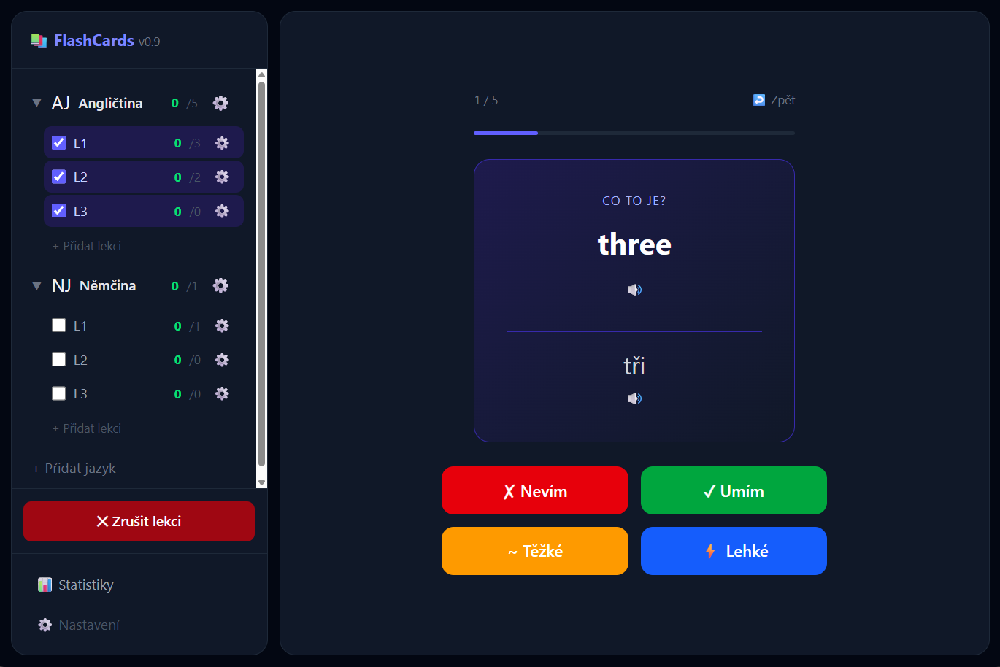

# FlashCards

Webová aplikace pro učení cizích jazyků pomocí kartiček a algoritmu spaced repetition (SM-2). Self-hosted, běží v Dockeru.



## Funkce

- **Spaced repetition (SM-2)** — kartičky se opakují v optimálních intervalech podle toho, jak dobře je uživatel zná
- **Jazyky a lekce** — kartičky organizované do jazyků a lekcí, směr učení (přední→zadní / zadní→přední / náhodně) nastavitelný na úrovni jazyka i lekce
- **Auto překlad** — návrh překladu přes self-hosted LibreTranslate při vytváření kartičky
- **Wiktionary integrace** — automatické doplnění gramatického rodu (např. u němčiny) ze slovníku
- **Import** — hromadný import kartiček z JSON
- **Média** — obrázky a audio ke kartičkám
- **Statistiky** — streak kalendář (30 dní), graf pokroku (14 dní), historie učení
- **TTS** — přehrání výslovnosti kartičky

## Tech stack

| Vrstva | Technologie |
|---|---|
| Frontend | Vue 3 (Composition API), Vite, Pinia, Tailwind CSS |
| Backend | FastAPI (Python), SQLAlchemy (async) |
| Databáze | PostgreSQL |
| Migrace | Alembic |
| Překlad | LibreTranslate (self-hosted) |
| Webserver | Nginx (reverse proxy + statické soubory) |
| Testy | pytest, pytest-asyncio |
| Deployment | Docker Compose |

## Architektura

```
Uživatel (prohlížeč)
    ↓
Nginx
    ├── /          → Vue 3 SPA (statické soubory)
    └── /api/*     → FastAPI backend
                        ├── PostgreSQL
                        ├── LibreTranslate
                        └── Media volume (obrázky, audio)
```

## Spuštění

```bash
cp .env.example .env
docker compose up --build
```

Aplikace poběží na `http://localhost`.

## Vývoj

Backend:
```bash
cd backend
pip install -r requirements.txt
uvicorn app.main:app --reload
```

Frontend:
```bash
cd frontend
npm install
npm run dev
```

Testy (backend):
```bash
cd backend
pytest
```

## Struktura projektu

```
backend/
  app/
    routers/     # API endpointy (cards, lessons, languages, study, stats, translate, wiktionary, import)
    models/      # SQLAlchemy modely
    services/    # SM-2 algoritmus, práce s médii
    schemas/     # Pydantic schémata
  alembic/       # DB migrace
  tests/
frontend/
  src/
    views/       # Dashboard, Study, Stats, CardList, CardEditor, Import
    components/  # UI komponenty (study, sidebar, modals, layout)
    stores/      # Pinia store
nginx/           # reverse proxy config
```
